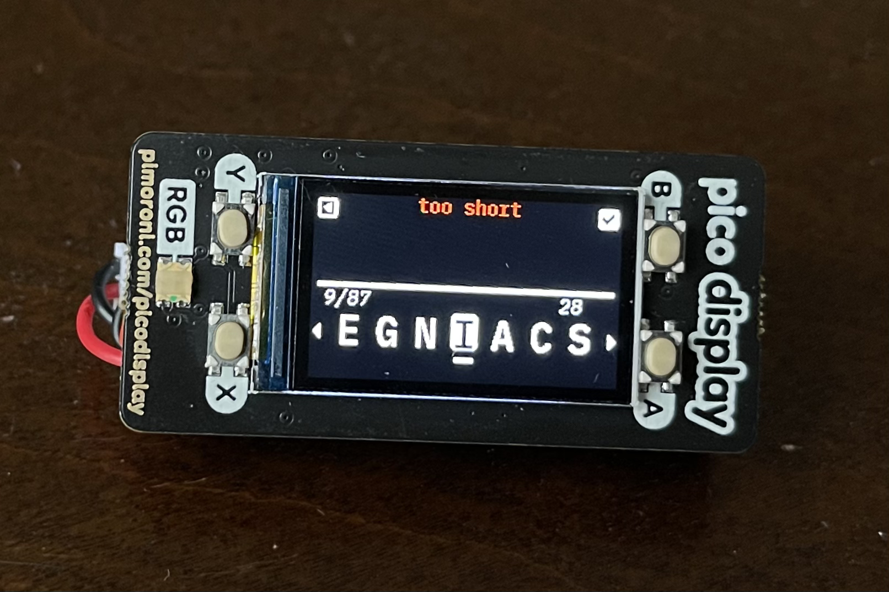
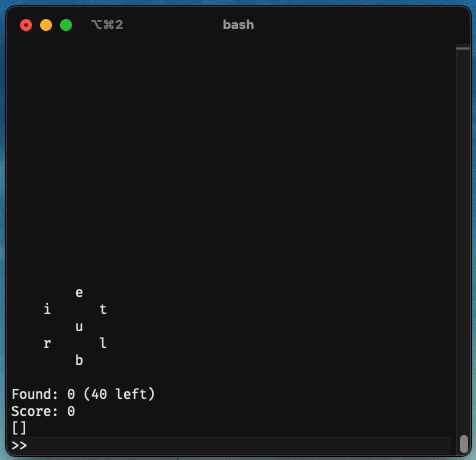

<h3 align="center" >
  <strong style="font-size:1.17em">The BumbleBee</strong>
  <br>
  <h6 align="center" style="margin-top:0; margin-bottom:0">
    by <a href="https://nickesc.github.io">N. Escobar</a> / <a href="https://github.com/nickesc">nickesc</a>
  </h6>
  <h6 align="center" style="padding-top:5px; margin-top:0; margin-bottom:2em">
    a portable word game generator<br>based on <i>The New York Times</i> Spelling Bee
  </h6>
</h3>


## Table of Contents

1. [__Introduction__](#introduction)
2. [__Components__](#components)
   - [Hardware](#hardware)
   - [Software](#software)
3. [__Gameplay__](#gameplay)
   - [How to play](#how-to-play)
     - [Rules](#rules)
     - [Scoring](#scoring)
   - [Device Gameplay](#device-gameplay)
     - [Game Screen](#game-screen)
     - [Info Screen](#info-screen)
     - [Grid Screen](#grid-screen)
     - [Device Diagram](#device-diagram)
     - [Tips](#tips)
     - [Troubleshooting](#troubleshooting)
   - [CLI Gameplay](#cli-gameplay)
     - [Running](#running-as-a-cli)
     - [Usage](#usage)
     - [Game Board](#cli-gameboard)
     - [Commands](#commands)
4. [__Setup and Assembly Guide__](#setup-and-assembly-guide)
   1.  [Install CircuitPython on the device](#i-install-circuitpython-on-the-device)
   2.  [Assemble the device](#ii-assemble-the-device)
   3.  [Deploy code to the device](#iii-deploy-code-to-the-device)
   4.  [Test the BumbleBee](#iv-test-the-bumblebee)
5. [__Design and Development__](#design-and-development)
   - [Inspiration and Design Goals](#inspiration-and-design-goals)
   - [Architecture](#architecture)
   - [Development Process](#development-process)
     1. [Finding the `buzzword`](#finding-the-buzzword)
     2. [Determining the rest of the `Bee`](#determining-the-rest-of-the-bee)
     3. [Adding gameplay and the CLI](#adding-gameplay-and-the-cli)
     4. [Porting to the microcontroller](#porting-to-the-microcontroller)
        1. [Reevaluating the dictionary](#reevaluating-the-dictionary)
     5. [Handling input on device](#handling-input-on-device)
     6. [Attaching the display](#attaching-the-display)
     7. [Finishing the game](#finishing-the-game)  
   - [Future Work](#future-work)
6. [__References and Acknowledgements__](#references-and-acknowledgements)
7. [__License__](#license)


## Introduction

### The BumbleBee is a portable word game generator -- its games are called `Bees`

The goal of each `Bee` is to make as many words as you can only using a set of seven letters, including one `keyletter` that needs to be in every word. 

<p align="center">
  
</p>

The device itself is built with a Pimoroni Pico LiPo as the controller and a Pimoroni Display Pack for the display and four face buttons. 

A detailed overview of the project, its purpose, main features, and how it addresses the problem it aims to solve. 
Provide a clear and concise summary of the project's functionality and the end goal it aims to achieve.


## Components:

### Hardware

Pimoroni Pico LiPo *16MB* | Pimoroni Pico Display Pack | ***Optional:*** <br> *110mHa* 3.7v LiPo battery (*301230*)
------------  | -------------  | ------------- 
[](https://shop.pimoroni.com/products/pimoroni-pico-lipo?variant=39335427080275) | [](https://shop.pimoroni.com/products/pico-display-pack) | 

### Software:

#### CircuitPython
- version: 7.3.3 
- board variant: [Pico LiPo (16MB)](https://circuitpython.org/board/pimoroni_picolipo_16mb/)
- required built-in libraries:
  - [`board`](https://docs.circuitpython.org/en/latest/shared-bindings/board/index.html) – board specific pin names
  - [`busio`](https://docs.circuitpython.org/en/latest/shared-bindings/busio/index.html) – hardware accelerated external bus access
  - [`digitalio`](https://docs.circuitpython.org/en/latest/shared-bindings/digitalio/index.html) – basic digital pin support
  - [`displayio`](https://docs.circuitpython.org/en/latest/shared-bindings/displayio/index.html) – native helpers for driving displays
  - [`gc`](https://docs.circuitpython.org/en/latest/docs/library/gc.html#) – MicroPython library to control the garbage collector
  - [`json`](https://docs.circuitpython.org/en/latest/docs/library/json.html) – MicroPython library for JSON encoding and decoding
  - [`random`](https://docs.circuitpython.org/en/latest/shared-bindings/random/index.html) – pseudo-random numbers and choices
  - [`terminalio`](https://docs.circuitpython.org/en/latest/shared-bindings/terminalio/index.html) – displays text in a TileGrid with `displayio`
  - [`time`](https://docs.circuitpython.org/en/latest/shared-bindings/time/index.html) – time and timing related functions
- required libraries from the [*Adafruit CircuitPython Library Bundle 7.x*](https://circuitpython.org/libraries):
  - [`adafruit_bitmap_font`](https://docs.circuitpython.org/projects/bitmap-font/en/latest/) – loads `.bdf` or `.pcf` bitmap fonts into `displayio`
  - [`adafruit_display_shapes`](https://docs.circuitpython.org/projects/display-shapes/en/latest/index.html) – various common shapes like rectangles, circles, lines and others for use with `displayio`
  - [`adafruit_display_text`](https://docs.circuitpython.org/projects/display_text/en/latest/) – displays text using `displayio`
  - [`adafruit_rgbled`](https://docs.circuitpython.org/projects/rgbled/en/latest/api.html) – driver for RGB LEDs
    - Depends on [`simpleio`](https://docs.circuitpython.org/projects/simpleio/en/latest/) – helpers to simplify hardware interactions
  - [`adafruit_st7789`](https://docs.circuitpython.org/projects/st7789/en/latest/api.html) – `displayio` driver for ST7789 based displays

#### Python
- version: 3.11.0
- Required to run the CLI
- required libraries:
  - [`argparse`](https://docs.python.org/3/library/argparse.html) – parser for command-line options, arguments and sub-commands
  - [`json`](https://docs.python.org/3/library/json.html) – JSON encoder and decoder
  - [`random`](https://docs.python.org/3/library/random.html) – generate pseudo-random numbers

## Gameplay

<p align="center"></p>

### How to play:

Every `Bee` has five components:
1. `letterlist`: a list of seven letters available to the player to create words with
2. `keyletter`: one of the seven letters; this letter must be in every word
3. `wordlist`: the list of words all the words in the game's dictionary that can be made using the `letterlist`
4. `buzzword`: one word from the `wordlist`; the source of the `letterlist`
5. `score`: the number of points you've earned from guessing words
   
The player must use the letters in the `letterlist` and the `keyletter` to make words in the `wordlist`. Each time the player guesses a word correctly, the word's value is added to their `score`. Words with more letters or words that use every letter, like the `buzzword`, are worth more points. The game is won when the player has found every word in the `wordlist`.

#### Rules:

- *The `keyletter` must appear at least once in every guess*
- *Letters can be used more than once in a guess*
- *Guesses must be at least four letters and less than sixteen letters*
- *Guesses must be in English*
- *Guesses cannot be proper nouns (i.e.: words like Italian or Google don’t count)*
- *Words that have already been found do not add to your `score`*

#### Scoring
> 4 letter words are worth 1 point
> 
> 5+ letter words aren worth 1 point per letter
>
> *Panagrams use all seven letters and add 7 extra points*
>
> *There is one Buzzword per `Bee` that adds 10 extra points*

### Device Gameplay

#### Game Screen


The Game Screen has the `letterlist` and the guess input. To move the letter selector right or left press the `A button` or the `X button`. To select a letter to add to the guess press the `B button`, and to delete the last letter from the guess press the `Y button`.

Other functions can also be accessed by holding down the buttons. To shuffle the `letterlist` hold the `A button`. To submit the guess hold the `B button`. To generate a new `Bee` hold the `X button`. Winning a `Bee` will also generate a new `Bee`. To swap to the Info Screen hold the `Y button`.

<br>
<p align="center"></p>
<br>

#### Info Screen


The Info Screen shows you information about the words that you’ve found so far. It shows your current `score` and number of words found, as well as a scrollable list of the words you’ve guessed correctly.

To scroll the correct-guess list right or left press the `A button` or the `X button`. To swap back to the Game Screen press the `Y button`. To swap to the Grid Screen press the `B button`.

<br>
<p align="center"></p>
<br>

#### Grid Screen


The Grid Screen provides you with hints about the words in the `Bee`’s `wordlist`.  Press any button to swap back to the Info Screen.

- Each row represents a letter in the `Bee`’s `letterlist`.
- Each interior column represents a word length in the `Bee`’s `letterlist`, starting at four and going up until the maximum word length. 
- Each interior cell represents the number of words in the `letterlist` that have the column’s word length and start with the row’s letter. 
- The right column shows the total number of words that start with each row’s letter. The bottom row shows the total number of words with each column’s word length.

<br>
<p align="center"></p>
<br>

#### Device Diagram


<br>
<p align="center"></p>
<br>

#### Tips
- The device automatically saves your game, and returns you to your last game when turned off and on.
- The device may take several minutes to create a new game; its processor is small and trying its best.
- While the device loads and thinks, it will turn the front LED red. If the light is on, the device is working.

  <table style="border: 0px" align=center>

    <tr style="border: 0px">
      <td style="border: 0px"></td>
      <td style="border: 0px"></td>
    </tr>

  </table>

- The BumbleBee’s dictionary does not contain every English word. Again, it is not powerful, and needs a smaller word set to function.
- When you submit a guess, the BumbleBee will give you an alert at the top of the screen to tell you how it was interpreted. These are a few of those alerts:
  
  <table style="border: 0px; background-color:#00000000" align=center>

    <tr style="border: 0px; background-color:#00000000">
      <td style="border: 0px; background-color:#00000000"></td>
      <td style="border: 0px; background-color:#00000000"></td>
    </tr>

    <tr style="border: 0px; background-color:#00000000">
      <td style="border: 0px; background-color:#00000000"></td>
      <td style="border: 0px; background-color:#00000000"></td>
    </tr>

  </table>
  
> **Warning**
> - DO NOT press the button labeled `BOOT`, it may corrupt the device
> - Try not to disconnect or remove the LiPo battery from the device 
> - Connecting the device to a computer will prevent it from saving


#### Troubleshooting

- The BumbleBee takes a long time to generate a new `Bee`. Be patient with it, put it down for 2-10 minutes then come back to it. A new `Bee` generates infrequently enough that it shouldn't be huge a issue to wait for a little while
- The battery will only last so long, and doesn't have a way to be measured. A full charge on the device's battery should last about 45 minutes to 1 hour
- The grid is difficult to read – though the word length labels are missing, the leftmost column is always for words that are four letters long – the grid is pretty much the same as the NYTSB's otherwise
- If at any point the device is freezing or functioning poorly or incorrectly, there should be little danger in simply turning it off and on again – the game saves automatically at the start of every game and on every guess

***A demonstration of the device's full functionality can be found on [Youtube]():***

<a href="https://youtu.be/0ogGuraG_Yg"></a>


### CLI Gameplay

While the `Bee` class is designed to be deployed to a device, `Bees` can still be played without a device using a command-line interface and Python. `Bees` played over command-line are the same as the ones played on a device.

#### Running as a CLI

1. Clone or download [the BumbleBee repository](https://github.com/nickesc/BumbleBee):
    
    ```sh 
    git clone https://github.com/nickesc/BumbleBee
    ```

2. Enter the BumbleBee directory using the command-line:
   
    ```sh 
    cd BumbleBee
    ```

3. Run:
    
    ```sh 
    python3 bumblebee.py
    ```

   - To start a game with a new `Bee` instead of the last saved `Bee` state, run:
      
      ```sh 
      python3 bumblebee.py --new
      ```

#### Usage

```
usage: python3 Bee.py [-h] [-n]

A CLI word game generator based on the New York Times Spelling Bee

options:
  -h, --help  show this help message and exit
  -n, --new   start a new game; default is to use the Bee state stored in ./BumbleBee/bee_state

CLI commands:
  -new      generate a new Bee
  -grid     toggle the hint grid
  -cheat    toggle the wordlist
  -shuffle  shuffle the order of the letterlist

Running the CLI will start a Bee. By default, the game will use the data from the last saved Bee state. Enter words into the input to submit them as guesses or enter commands to execute them.

For more information visit:
  https://github.com/nickesc/BumbleBee#cli-gameplay
```

#### CLI Gameboard


The gameboard, modeled after the hexagon from *The New York Times* Spelling Bee, is printed before each guess:

```

        o
    s      i
        c
    n      r
        t

Found: 0 (59 left)
Score: 0
[]
```

Below the gameboard is the command-line input for the CLI. Enter words into the command-line to submit them as guesses or enter commands to execute them:

```
>> _
```

The game will print a response to the last guess above the gameboard, and as correct guesses are inputted to the command-line, words are added to the list at the bottom, and your `score` and the number of words found increase:

```
cotton was found!

        o
    s      i
        c
    n      r
        t

Found: 5 (54 left)
Score: 22
['coin', 'scoot', 'sonic', 'costs', 'cotton']
```

Once the player has guessed all the words in the `Bee`'s `wordlist` the game is won and it will end. To start a new game after winning, run the CLI again. A new `Bee` can also be generated at any time by inputting `-new` to the CLI.

##### Commands

Inputting `-shuffle` to the command-line will shuffle the order of the Bee's `letterlist` to give you a new perspective. The `keyletter` will always remain in the center.

Inputting `-grid` to the command-line will toggle whether the `Bee`'s hint grid is printed with the gameboard:

> ```
> o   -      -      -      -      -      -      -      -      -      -      0      
> s   1      3      3      1      1      -      -      -      -      -      9      
> i   1      1      1      1      3      3      -      -      -      -      10      
> c   6      5      6      7      4      2      4      2      1      1      38      
> n   -      -      -      -      -      -      -      -      -      -      0      
> r   -      -      -      -      -      -      -      -      -      -      0      
> t   -      1      1      -      -      -      -      -      -      -      2      
> 
> $   8(4)  10(5)  11(6)  9(7)  8(8)  5(9)  4(10)  2(11)  1(12)  1(13)  59($)
> ```
>
> The grid can be read the same way as on the device. The only benefit of this grid over the one on the device is that in the CLI the word lengths in each column are labeled in parentheses next to the column total.

Inputting `-cheat` to the command-line will toggle whether the `Bee`'s `wordlist` and `buzzword` are printed with the gameboard:

> ```
> Word List:
> {'citric': 6, 'cocoon': 6, 'cocoons': 7, 'coin': 1, 'coins': 5, 'concoct': 7, 'concoction': 10, 'concoctions': 11, 'concocts': 8, 'cons': 1, 'consist': 7, 'consists': 8, 'consort': 7, 'consorts': 8, 'constrict': 16, 'constriction': 19, 'constrictions': 20, 'constricts': 17, 'contort': 7, 'contortion': 10, 'contortions': 18, 'contorts': 8, 'coos': 1, 'corn': 1, 'corns': 5, 'corrosion': 9, 'cost': 1, 'costs': 5, 'cots': 1, 'cotton': 6, 'cottons': 7, 'crisis': 6, 'crisscross': 10, 'critic': 6, 'critics': 7, 'croon': 5, 'croons': 6, 'cross': 5, 'icon': 1, 'icons': 5, 'incision': 8, 'incisions': 9, 'incisor': 7, 'incisors': 8, 'instinct': 8, 'instincts': 9, 'intrinsic': 9, 'ironic': 6, 'scissor': 7, 'scissors': 8, 'scoot': 5, 'scoots': 6, 'scorn': 5, 'scorns': 6, 'sics': 1, 'sonic': 5, 'strict': 6, 'tonic': 5, 'tonics': 6}
> Buzzword: constrictions
> ```
>
> The ability to cheat with the `wordlist` is the only difference between the game on the device and the CLI. The `wordlist` shows you every word in the `Bee`'s dictionary that can be made using the letters in the `letterlist` and the `keyletter` and what each of them is worth.

## Setup and Assembly Guide

*This guide assumes the use of a UNIX based OS, some commands and folders may be different and some scripts may need to be edited if working on Windows*

### I. Install CircuitPython on the device

1. Test that the Pico LiPo is working – ensure that it turns on when connected to power
   
   > 
   >
   > *verify the device is on by checking that the power LED lights up when plugged in*
   
2. Download the ***CircuitPython 7.3.3*** `.uf2` file from the [CircuitPython Pimoroni Pico LiPo 16MB page](https://circuitpython.org/board/pimoroni_picolipo_16mb/)
   - the CircuitPython file can also be found in this project at [`uf2/adafruit-circuitpython-pimoroni_picolipo_16mb-en_US-7.3.3.uf2`](https://github.com/nickesc/BumbleBee/blob/main/uf2/adafruit-circuitpython-pimoroni_picolipo_16mb-en_US-7.3.3.uf2) 

3. Put the Pico LiPo into `Bootloader Mode` while connected to the computer
   - Because there is no reset button on the Pico LiPo, we can start the `UF2 Bootloader` by holding the `BOOT` button and pressing the `POWER` button twice while the device is powered to simulate a reset – a new drive named `RPI-RP2` should be connected to the computer if it was successful

      >  
      >
      > 1. *The Pico LiPo's `POWER` (top) and `BOOT` (bottom) buttons*
      > 2. *And the `RPI-RP2` Finder window, showing the `RPI-RP2` drive mounted*

4. Drag the Pico LiPo CircuitPython `.uf2` file into the `RPI-RP2` drive

    > 
    > 
    > *The Finder window may freeze when the file is dragged in*
 
 - though supposedly fixed in MacOS 13.1, [some users who have upgraded to MacOS Ventura have reported](https://blog.adafruit.com/2022/10/31/uploading-uf2-files-with-macos-13-0-ventura-apple-microbit_edu-raspberry_pi-circuitpython/) that the drag-and-drop functionality for bootloader drives has been broken; if there is an error when trying to drag the file, transfer the file to the `RPI-RP2` drive using the command-line. A command like this should work: `cp -X <download_location>/<circuitpython_file>.uf2 /Volumes/RPI-RP2`

5. Transferring the file will take a few seconds, but once the `RPI-RP2` drive ejects, a new drive labeled `CIRCUITPYTHON` should replace it if the device was flashed successfully
 
    > 
    >
    > *The newly mounted `CIRCUITPYTHON` Finder window, showing a board flashed successfully*

6. Using a serial monitor ([the Mu Editor has a simple one](https://learn.adafruit.com/welcome-to-circuitpython/kattni-connecting-to-the-serial-console)) ensure that the [REPL](https://codewith.mu/en/tutorials/1.2/repl) is accessible

7. Eject the Pico LiPo's `CIRCUITPYTHON` drive from the computer 

### II. Assemble the device

1. Disconnect the Pico LiPo from power
2. Solder headers to the pin holes on the Pico LiPo – these are necessary for the display
   - here is a guide for help with that: [The MagPi: How to solder GPIO pin headers to Raspberry Pi Pico](https://magpi.raspberrypi.com/articles/how-to-solder-gpio-pin-headers-to-raspberry-pi-pico)
3. Now the satisfying part – slot the pins of the Pico LiPo into the pin sockets on the Pico Display Pack
   - the Pico Display Pack has a graphic of the USB port on the underside of the board to indicate in which orientation the Pico is supposed to be attached – make sure to align the port on the controller with the graphic and carefully line all the pins up so they go in the correct sockets
 4. ***Optional:*** Connect the battery's JST connector to the Pico LiPo's JST port – ensure the power and ground wires on the battery match the labels on the Pico LiPo
    - if the battery comes without a JST connector, as mine did, you may need to [solder one on yourself as I did](https://youtu.be/3qclg4jz-54). Ensure the right wires from the battery are being connected to the right pins on the connector and that they also match up with the labels on the board
    1. Slot the battery in between the Pico LiPo and the Pico Display Pack and tuck in the wires, careful not to damage any connections

> <p align="center">
>   
>   <br>
>   <i>Once assembled, the device should look like this</i>
> </p>

### III. Deploy code to the device

#### Option 1: using the command-line

1. Connect the Pico LiPo to the computer and ensure it is powered
2. Clone [the BumbleBee repository](https://github.com/nickesc/BumbleBee) and enter the directory:
    
    ```sh 
    git clone https://github.com/nickesc/BumbleBee
    cd BumbleBee
    ```

3. Upload the code to the device by executing: 
    
    ```sh
    ./deploy.sh
    ```

   - if the command-line returns `Permission denied` or `Command not found`, execute `chmod +x ./deploy.sh` before running `./deploy.sh` again
   - the code may take a few minutes to upload, *do not* disconnect the device until the screen settles and the game starts
   - *do not* disconnect the device without ejecting it first

#### Option 2: drag-and-drop

1. Connect the Pico LiPo to the computer and ensure it is powered
2. Download the [latest release from the BumbleBee repository](https://github.com/nickesc/BumbleBee/releases)
3. Unzip the `BumbleBee_release.zip` archive
4. Drag the contents of the archive into the `CIRCUITPYTHON` drive, and replace any files that are already there
   - the code may take a few minutes to upload, ***do not*** disconnect or turn off the device until the screen settles and the game starts
   - ***do not*** disconnect or turn off the device without ejecting it first

### IV. Test the BumbleBee

*For more information on how to use the BumbleBee, which may be useful when testing, see the [Manual](docs/Manual.pdf) or [**Device Gameplay**](#device-gameplay) section*

1. Make sure that the BumbleBee can receive input and registers it by moving the letter selector or changing to different screens
   - If the BumbleBee is still connected to the computer, the serial monitor should print the inputs and interactions with the game
2. Eject the BumbleBee from the computer, disconnect it from the computer and cycle the power.
   - If the BumbleBee doesn't have a battery, connect it to a non-computer power source like a wall-plug and turn it on 
3. Find a word in the `Bee` to test the game functionality
4. Cycle the power again to make sure the game saves
   - the game state will not save if the BumbleBee was turned on while connected to a computer


## Design and Development

### Inspiration and Design Goals

This project was largely inspired by and developed as a gift for my mom.

Recently, my mom has been absorbed in *The New York Time* Spelling Bee. She plays almost every day, spending the whole day coming back to the Spelling Bee to try to finish it. The game itself seemed like it would be pretty easy to emulate – it's a fairly simple concept, mostly scanning the dictionary for words with certain letters and checking strings against each other – and I was looking for a hardware project, so I figured I would try my hand at building a little game-device for her.

The requirements for this weren't that high – I know my mom will probably stick with *The New York Times'* version, her phone is usually nearby and has a much larger screen – but I set myself a few goals to make the thing usable:

- I wanted the game to play like *The New York Times* Spelling Bee
- I wanted the game to actually be playable (I've made unplayable games before)
- I wanted the device do be portable and untethered to a USB cable
- I wanted the device to have a screen that displayed a polished game GUI
- I wanted the player to be able to interact with the game on the device
- I wanted the player to be able to generate a new `Bee` anytime they wanted and play `Bees` over multiple days – unlike *The New York Times* Spelling Bee

I was not, however, super concerned about making it perfect. The device has flaws and the device can definitely be improved – for more of my thoughts on that see [Future Work](#future-work). The main goal was to make something fun that she could play the game with if she wanted to.

### Architecture


The core of the BumbleBee is the `Bee` class. The `Bee` class contains all the necessary code for the game, as well as connects the game to the device's hardware. It does this through it's `Controller`, an object which is only created when the game is run on the device, and not when it is run as a CLI. The `Controller` interfaces with the device's hardware through 4 hardware classes: `Button`, `Display`, `LED` and `RGB`. Each of these classes initializes one of the hardware components and makes it available to the game.

Once the `Bee` has been created, the game's main game-loops can be executed using either `Bee.guessCLI()` to start the CLI or `Bee.Controller.startGame()` to start the game on device. Each of them executes commands on the `Bee` to interact with it and change game data, and then reads the new game data back to update what it displays to the player.

### Development Process

The first step in the process, before I touched any hardware or CircuitPython, was to write the code for the core of the game itself. This became the `Bee` class in `src/bumblebee.py`, written in Python. This class isn't the game-loop itself but instead represents the game's information, its state, and contains the methods necessary to interact with the game.

But before we could get to any of that, we needed to figure out how to generate a game.

According to the NYTSB rules, each puzzle needs to have seven unique letters in the `letterlist` and one `keyletter`, and there's always at least one panagram in every puzzle. This tells us:

1. that every the puzzle must have at least one word that uses all seven of the letters in the `letterlist` 
2. and each new puzzle is likely generated based on that one word

That became our `Bee`'s `buzzword`.

#### Finding the `buzzword`

The basic idea to find a `buzzword` is to scan the dictionary for a word with exactly seven unique letters. A few different things go into this,  and the first is finding a dictionary to source the words from.

The dictionary you use for this game will determine the quality of the `Bee` . At some point, that dictionary needs to be curated, which can be done in a couple of ways: manually inputting words, automated scraping of the internet and books; the list can be further filtered based on a number of factors like language, age, complexity, obscurity, usage, region and more. 

> We can't just use every known word in the English language for a game like this. A game that includes a million obscure words that no one has used for a century isn't going to be very fun because no one will ever find half of them, and games will be unwinnable and frustrating
>
> Additionally, because we plan to put the project onto a microcontroller, we have to consider the size of our file and the speed we can go through our list; the processor on the board can only handle so much, as we'll see later.

At first I thought I would just be able to use the NYTSB word list, but apparently it's a [privately curated list](https://spellingbeetimes.com/2020/11/26/what-dictionary-does-nyt-spelling-bee-use/), so that's off the table. 

I started to get worried I might have to filter the list myself, something I wasn't relishing; A lot of the filters we could apply are subjective, and we'd need a way to analyze the content of the word, the complexity, the obscurity and a whole host of other things, as well as a source to compare the objective qualities of a word to like the age or region, which aren't contained directly in the letters.

Thankfully, others had already solved this problem for me. There are official word game lists maintained by people who do this professionally, and many of these lists do not include things like proper nouns or words with punctuation in them. My initial target was the Scrabble list, specifically the [*Official Tournament and Club Word List* or the *TWL06*](https://www.wordgamedictionary.com/twl06/download/twl06.txt).

In order to prep the dictionary specifically for our game, we could filter out any words that were less than 4 letters. Then, to get the list of words suitable to be a `buzzword`, we further filtered out any word that *did not have seven unique letters.* These lists became our game dictionary and our `buzzword` candidates (until we run into issues with the hardware later), and are saved in `dictionary/`.

> The final imputation of the word lists can be found in [`getBuzzCandidates.ipynb`](https://github.com/nickesc/BumbleBee/blob/main/getBuzzCandidates.ipynb), a Jupyter notebook that outputs the dictionary files for the game.

Finally, to get a `buzzword` for a `Bee` , we can grab any random word from the `buzzword` candidate list.

#### Determining the rest of the `Bee` 

Now that we have the `buzzword` we can use it to find out the rest of the information for the `Bee` :

1. the seven unique letters in the `buzzword` become the `letterlist`
2. one random letter from the `letterlist` becomes the `keyletter`
3. we scan the game dictionary for words that can be made with the `letterlist` and the `keyletter`, which becomes the `wordlist`
   -  we loop through every word in the dictionary, checking if it contains the `keyletter`. If it does, we check if the rest of the word's letters are in the `letterlist`. If they are, it gets added to the `Bee` 's `wordlist` as a key-value pair, with the word as the key and it's point-value as the value
      -  a word's point-value is based on the length of the word, but bonus points are added for words that use every letter and the `buzzword`

In order to make the `Bee`  persist when you relaunch the game, the data from the `Bee`  is saved to text files in the `bee_state` folder, and the state can be read from them when the game is launched to resume the last`Bee` .

#### Adding gameplay and the CLI

Now that we had the core of the game done, we could introduce the gameplay loop: guessing words.

- the player inputs a string and submits it as a guess
- the game checks the guess against the `wordlist`
  - if the guess is in the `wordlist` and hasn't been guessed, add it to the list of successful guesses and add the word's value to the player's `score`
  - otherwise the word is added to the list of failed guesses
- the game responds with whether the guess was successful or not
- the player guesses again until every word in the `wordlist` has been found

Getting input is handled in the game loop. This means we needed `Bee` methods:

- to generate a `Bee` and set the game data: `Bee.setBuzzword()`
  - the game chooses a random `buzzword` candidate; if the candidate is viable (has enough words in its `wordlist`) it sets the game data and saves the initial state. Otherwise, it picks a new random candidate and tests it again until it finds a good one
- to submit a guess to the`Bee`  and check it: `Bee.guess()`
  - the game checks whether the guess is in the `wordlist` or not; if it is, it refers it to the success method, otherwise it refers it to the fail method. Either way, it returns the guess code returned by either function
- for if the guess is successful: `Bee.success()`
  - returns the guess code for successful guesses, repeat guesses, panagrams and `buzzword`s; also adds the guess to the successful guess list, writes it to the successful guess file, and updates the player's `score`
- for if the guess fails: `Bee.fail()`
  - returns the guess code for failed guesses, empty guesses, short guesses and guesses missing the `keyletter`; also adds the guess to the failed guess list and writes it to the failed guess file
- to interpret the response to the guess: `Bee.getGuessCode()`
  - using the guess code, returns the string to give the player about the status of their guess
- to check if the game has been won: `Bee.checkForWin()`
  - returns if all the words in the `wordlist` are in the successful guess list
- and to display the game to the player
  - after each input, the game needs to update to reflect the input; how this is done is also handled by the game-loop
- along with a few supporting methods

The first implementation of the game was as a CLI, to prove that the game worked and each of these methods functioned together before porting it to a microcontroller and CircuitPython. 

In order to start the the CLI, you need to create a new `Bee`  and call the `guessCLI` function:

```python
cliBee = Bee(new=newGame)
cliBee.guessCLI()
```

<p align="center">
  
</p>

This starts a loop that prints out the gameboard, showing it in the classic NYTSB hexagon with `Bee.printBee()`, asks the player to input their guess using the keyboard, interprets the guess and loops.

In addition to guesses, the player can also submit commands to the CLI with keywords prefixed by a `-`. The player can generate a new `Bee` with `-new`, shuffle the `letterlist` with `-shuffle`, print the `Bee`'s [hint grid](#grid-screen) with `-grid` or print the `Bee`'s `wordlist` with `-cheat`.

> [The CLI is still playable using Python](#running-as-a-cli) if you want to check it out. The CLI was designed mostly as a development tool, but it works, so why not leave it in? 

CLI and game-logic done, we could move onto the whole point of it all. Getting it to work on a CircuitPython board.

#### Porting to the microcontroller

My main goal for this project, because open-source Python implementations of the game already exist, was not to just recreate *The New York Times* Spelling Bee. It was to put that game on a portable device with a microcontroller.

I'd wanted to work in Python and had already written the `Bee` in Python, so my main options for moving the code to a microcontroller were either MicroPython or its derivative from Adafruit, CircuitPython. The components I was using would have worked with either, but the libraries and the really great documentation for CircuitPython from Adafruit with real world uses and examples lured me in.

This project uses three hardware components:
- [Pimoroni Pico LiPo *16MB*](https://shop.pimoroni.com/products/pimoroni-pico-lipo?variant=39335427080275)
- [Pimoroni Pico Display Pack](https://shop.pimoroni.com/products/pico-display-pack)
- 110mHa 3.7v LiPo battery (*model 301230*)

The hardware behind the project largely came down to what I had available. I'd bought the Pico LiPo and Display Pack a few weeks earlier and had been on the lookout for something to use them for. When I came up with this idea, they were the first things I thought of because they fit my needs pretty perfectly.

The Pico LiPo is a Raspberry Pi Pico drop-in replacement with 16MB of storage and a built-in JST connector for a LiPo battery. One of the nice things about the Pico LiPo is that it has a power button instead of a reset button, which toggles the power state instead of restarting the device. The JST connector and the power button make it ideal to use for a battery powered device.

The Pico Display Pack is a hat for the Raspberry Pi Pico that also functions with the Pico LiPo that provides the Pico with input and output components. It includes a 240x135 pixel LCD TFT display surrounded by four push-buttons and an RGB LED. Though the Pico Display Pack is intended for use with MicroPython, there are pre-made libraries for CircuitPython that make fairly easy to use each of the components, especially the display, which can use the CircuitPython `ST7789` driver.

Put together with a small enough LiPo battery, like the 110mHa battery I had lying around, you have a fully standalone device, with ability to receive input and display output in multiple ways.

CircuitPython is similar enough to Python that I was fairly confident the CLI could just be moved to the Pico LiPo without any problems, just swapping out a `bash` command line for the REPL. I was mistaken. I had failed to take into account the hardware differences between my computer and the Pico LiPo – and there are many.

##### Reevaluating the dictionary

The problem I ran into first porting it had to do with the way I was using the dictionary files.

In order to quickly read the dictionaries, I had been loading them into memory from `.json` files as `dict` objects. This reduced the speed to iterate over the entire list, but meant I had two huge objects in memory. This was fine on a computer with 64GB of memory, but the Pico LiPo has... 264kB. And how big is the `TWL06` derived `dictionary.json` file? 2.8MB. Oh. That's a problem. Sounds like we need to either *significantly* reduce our word list or find a different way to read the dictionaries.

First I tried to find shorter dictionaries with plaintext sources, but nothing smaller seemed to have the same quality that the TWL06 did, and it didn't have the right coverage when I tried removing words randomly from the list.

But even so, no matter what I did, I couldn't get the list small enough to load into the memory of the Pico LiPo. It was simply too many strings to handle on top of running the rest of the device. And even if we could get it just small enough to fit, filling up the memory here would make it impossible to use a display, which are notoriously memory hungry. This almost killed the project but I was determined to make it work.

The next option was to avoid loading the dictionaries to memory. Thankfully the dictionaries were only referenced twice, so this would only change two things for the existing code:

1. The `setBuzzword` supporting methods would need to use the `with open(file) as f:` syntax and loop through the contents of the files without saving them to variables
2. and the `fail` method would not be able to return whether a failed guess was a real word or not, only that it did not meet the rules or was not in the `wordlist`, because the game would no longer reference the dictionary outside of `Bee` generation

Changing the way the dictionaries were read also meant we needed to change the way they were outputted though – because we can no longer load the dictionaries as `dict` objects, it doesn't make sense to use a `.json` file anymore. Instead, we can use a `.csv` file, which lets the program just read each line individually without processing it and significantly reduces file size by getting rid of extraneous characters. This also meant choosing a random `buzzword` actually became choosing a random line number from the `.csv` because we could no longer use the `random` sequence methods.

> Old methods and files from when the lists were still `.json` files can still be found in a few places around the repository, but aren't used anywhere but the [`getBuzzCandidates.ipynb`](https://github.com/nickesc/BumbleBee/blob/main/getBuzzCandidates.ipynb) Jupyter notebook

This solved the problem of running out memory, but the major drawback of this approach also comes down to the Pico LiPo's hardware limitations: it's slow.

Like, it took over 20 minutes to just read the `TWL06` dictionary once, slow. This meant we needed to look into reducing our dictionary again. Wonderful.

The answer came in the form of another, similar project: [`open-spelling-bee` by *philshem*](https://github.com/philshem/open-spelling-bee). They'd unknowingly solved my problem for me, and the repository is included here as a submodule. `open-spelling-bee` is another open-source Python implementation of *The New York Times* Spelling Bee, but what interested me is their dictionary, and more specifically, its derivation method.

In order to change the complexity of games, `open-spelling-bee` allows the player to change how long their dictionary is – hallelujah! Just what I was looking for. The program uses [`SCOWL` by Kevin Atkinson](http://wordlist.aspell.net/), a database of words designed for use in applications like spellcheckers, but contains lots of information about the word as well. *philshem's* implementation is specifically geared towards word games like Spelling Bee, and works remarkably well for generating shorter lists.

Using `open-spelling-bee`'s implementation of SCOWL, I was able to reduce the size of the dictionary by *over 80%*. While the list still isn't perfect and it's still missing words I'd like to have in there, the dictionary has a solid amount of coverage without being too big and makes it *possible* for the list to be read by the device.

Unfortunately, this didn't mean that `Bee` could be generated just as fast as on a computer. The device is still only so powerful, and it has taken up to 10 minutes to generate a `Bee` when the device needs to go through a lot of `buzzword` candidates before it finds a good one. However, the average time to generate a game is usually around only 2-4 minutes, which I consider acceptable given the nature of the project and the likely infrequency of making a new game.

Fortunately, though, this did mean that the device was able to successfully run the CLI, using the REPL and keyboard to input guesses. We have liftoff!

#### Handling input on device

After getting the game itself running on the device, the next challenge was handling input. The CLI is nice because it requires the user to type inputs using their own keyboard. The CLI just processes strings returned from the builtin `input()` method, it doesn't need to worry about the hardware powering the keyboard.

The Pico Display Pack, on the other hand, provides us with four buttons to work with. That didn't seem like quite enough to build a full keyboard that most people could use (QMK would argue with this) so I had to find a different way to select letters.

Thankfully, no `Bee` needs a full keyboard, only seven letters. Even in the NYTSB, it doesn't give you a full keyboard, only the letters you need, which you can tap/click to add to the guess input string. The BumbleBee doesn't have a touch screen, so I decided to implement a scrolling selector that could be moved from one letter in the `letterlist` to another using the `A Button` and `X Button`.

From here, the CLI would no longer be used on the device, and we would start to build the `Controller` class and the on-board game-loop method: `Bee.Controller.startGame()`.

The `Controller` class is the manager for the hardware in the BumbleBee. It initializes and controls the display, the buttons and the lights on the BumbleBee. The `Controller` handles all input and output from the `Bee` to the device, and the `Controller` calls the same methods that the CLI does to interact with the `Bee`.

At first, I simply implemented a selector that used the REPL to display which letter it was on. Like the final game, it used the `A Button` to move it to the right and the `X Button` to move to the left. The `B Button` could be pressed to add a letter to a guess input string, and the `Y Button` could be pressed to submit and check if it was in the `Bee`'s `wordlist`; if the guess was successful, the game would end.

<p align="center">
  
  <br>
  <i>A demo of the first iteration of the device. The player selects and submits the letters for 'flap'</i>
</p>

The `Bee.Controller.startGame()` loop works a little differently than the CLI's loop. Waiting for the player to submit a word doesn't work because we need to handle all of the inputs. This loop, instead, is not quite a state-machine. It loops over and over, checking for input on each button. If the button is detected as pressed on that iteration of the loop, it reacts accordingly. The `X Button` and `A Button` control an integer that starts at zero and always remains between 0 and 6. It represents the index of the `letterlist` that the letter selector is selecting. To move the selector right, we add 1 to the index with the `A Button`, and to move left we subtract 1 from the index with the `X Button`, and then we update the currently selected letter to the current index. When the `B Button` is pressed, it adds the currently selected letter to a guess string, and when the `Y Button` is pressed, it submits the guess string to the `Bee` with `Bee.guess(guess_string)`. If the guess returns a 'found' guess-code then the loop ends, otherwise it clears the guess string and loops again.

This meant we had to write a `Button` class, which we can assign to each of the face buttons on the Pico LiPo. `Button` is a simple class that sets up the hardware resources for the button and gives us a method, `Button.pressed()` to check the hardware's current state.

We also write a small `LED` class that can be used to communicate when the device is thinking to the player. It connects to the Pico LiPo's onboard user LED, though it will later be swapped with an `RGB` class for the more robust RGB LED on the Pico Display Pack's face.

The basic pseudo-code for the `Controller` looks like this:

``` python
class Controller(bee):
    letters = bee.letterlist
    words = bee.wordlist
    letter_index = 0
    guess_string = ""

    function initHardware()
        A_button = Button(board.A_pin,"a")
        B_button = Button(board.B_pin,"b")
        X_button = Button(board.X_pin,"x")
        Y_button = Button(board.Y_pin,"y")
        busy_led = LED(board.led_pin)

    function startGame():
        initHardware()
        end=False
        while not end:
            if A_Button.pressed():
                if letter_index < 6:
                    letter_index++
                    print(letters[letter_index])

            elif B_Button.pressed():
                guess_string = guess_string + letters[letter_index]
                print(guess_string)

            elif X_Button.pressed():
                if letter_index > 0:
                    letter_index--
                    print(letters[letter_index])

            elif Y_Button.pressed():
                busy_led.on()
                code = Bee.guess(guess_string)
                if code == 1 or 7 or 10:
                    end = True
                else:
                    guess_string = ""
                busy_led.off()
                print(guess_string)
```


The goal of this iteration was simply to be able to successfully move the selector and select letters and submit words, the main interactive functions of the game; the rest of the device facilitates those action. A more sophisticated iteration of the device allowed for an almost full game to be played as it is on the finished BumbleBee, but printed to the REPL instead of the device's display.

<p align="center">
  
  <br>
  <i>The second iteration, showing a playable game – it's a little easier to see where the letter selector is in the <code>letterlist</code>, because the game prepends spaces to the letter according to the letter's index in the <code>letterlist</code></i>
</p>

The second iteration had a few extra things but was built on the same foundation. This was almost the full game, playing like the final version but over the REPL. For the most part, all it was waiting for was to be attached to the display. 

Changes over the last iteration include:
- instead of waiting for a successful guess, the loop will run until the device is turned off
- pressing the `Y Button` has been changed to delete the last letter from the guess
- the device accepts held inputs now, which can give each of the four face buttons alternate functions
  - for instance, to submit a word, now the player holds the `B Button`
  - to gauge whether a button has been held, the program starts a loop when the button is first pressed, and if the button has been pressed for every iteration of that loop until several seconds have passed, the button registers as pressed

The game also gives the player another UI, the Info Screen, which is accessed by holding the `Y Button` and shows the current `score` and words left, as well as letting the player scroll through their successful guesses, similar to the `letterlist` scrolling, with the `A Button` and `X Button`. The Info Screen can be backed out of by pressing the `Y Button`, which returns you to the main UI, the Game Screen.

In this iteration, the exact behavior of the loop depends on what UI you're looking at, but it runs over and over without stopping until the device is turned off. When you change the UI, you move to a nested loop, and when you exit the UI you move back to the initial loop. In any UI though, on each iteration of the loop it checks for input, either pressed or held buttons, and reacts based on what that input does in that UI loop:

``` python
class Controller(bee):
    letters = bee.letterlist
    words = bee.wordlist
    letter_index = 0
    guess_string = ""
    
    function initHardware():
        A_button = Button(board.A_pin,"a")
        B_button = Button(board.B_pin,"b")
        X_button = Button(board.X_pin,"x")
        Y_button = Button(board.Y_pin,"y")
        busy_led = LED(board.led_pin)

    function updateGame():
        busy_led.on()
        bee.setBuzzword()
        guess_string = ""
        letters=bee.letterlist
        words=bee.wordlist
        print(letters)
        busy_led.off()

    function moveCursorX(index,spaces):
        index = index + spaces

    function startGame():
        initHardware()
        ui = "game"
        end=False
        while not end:
            currTime = time.now()
            held = False

            if A_Button.pressed():
                while A_Button.pressed():
                    if time.now() == currTime + 2:
                        updateGame()
                        held = True
                        break
                if not held:
                    if letter_index < 6:
                        moveCursorX(letter_index,1)
                        print((letter_index * " ") + letters[letter_index])

            elif B_Button.pressed():
                while B_Button.pressed():
                    if time.now() == currTime + 2:
                        code = bee.guess(guess_string)
                        print(bee.getGuessCode(code))
                        if bee.checkWin():
                            updateGame()
                        held = True
                        break
                if not held:
                    guess_string = guess_string + letters[letter_index]
                    print(guess_string)

            elif X_Button.pressed():
                if letter_index > 0:
                    moveCursorX(letter_index,-1)
                    print((letter_index * " ") + letters[letter_index])

            elif Y_Button.pressed():
                while Y_Button.pressed():
                    if time.now() == currTime + 2:
                        guess_index=0
                        ui = "info"
                        while ui == "info":

                            if A_Button.pressed():
                                if guess_index < guessCorrect.length:
                                    moveCursorX(guess_index,1)
                                    print(bee.guessCorrect[guess_index])

                            elif X_Button.pressed():
                                if guess_index > 0:
                                    moveCursorX(guess_index,-1)
                                    print(bee.guessCorrect[guess_index])

                            elif Y_Button.pressed():
                                ui = "game"

                        held = True
                        break
                if not held:
                  guess_string = guess_string[:-1]
                  print(guess_string)
```

> Not depicted in that pseudo-code is the [debouncing solution](https://learn.adafruit.com/multi-tasking-with-circuitpython/buttons). To avoid unwanted activations, at the end of each loop the `Controller` will take the button check from that iteration of the loop and set it to a variable that represents the previous iteration's button states. Then, in the next iteration, when checking whether the buttons are pressed or not, it only lets it pass if the button's state is different from its previous state. 
>
> ```python
> button = Button(board.button_pin,"button")
> 
> prev_state = False
> curr_State = False
> 
> while not end:
>     curr_state = button.pressed()
>     currTime = time.now()
>     held = False
> 
>     if curr_state == True and curr_state != prev_state:
>         while button.pressed() == True:
>             if time.now() == currTime + 2:
>                 
>                 ## Do something when button is held...
> 
>                 held = True
>                 break
>         if not held:
> 
>             ## Do something when button is pressed...
>     
>     prev_state = curr_state
> ```
>
> Practically, this means that if your finger is on a button it will only activate on the first iteration of the loop. Or, if you're pressing a button over two iterations of a loop and it returns `button.pressed()` as `True` both times, it will only activate on the first `True` and ignore any others until it registers `button.pressed()` as `False`:

At this point, we were still only printing to the REPL. The game was fully playable and mostly in the form it would end up being, but it still required a connection to a computer and a serial monitor in order to see and play the game.

#### Attaching the display

So, next up was to connect the game to the device's tiny display. This was one of the things I was most excited to explore with this project, because I didn't have much experience working with hardware displays before this.

The Pico Display Pack's provided libraries were all built in [MicroPython](https://github.com/pimoroni/pimoroni-pico/tree/main/micropython/modules/picographics) or [C/C++](https://github.com/pimoroni/pimoroni-pico/tree/main/libraries/pico_display), but compatibility with CircuitPython is easily achievable using [libraries from Adafruit for an ST7789](https://github.com/adafruit/Adafruit_CircuitPython_ST7789), which the display the Pico Display Pack uses.

In CircuitPython, displays can use [`displayio`](https://docs.circuitpython.org/en/latest/shared-bindings/displayio/) to draw things like text, shapes and images to the display (with a number of other [helper libraries](https://learn.adafruit.com/circuitpython-display-support-using-displayio/helper-libraries)). The first thing I wanted to do with the display was make sure that I could get all that to work together – that all the libraries would work, that the hardware would work, and that I could get it connected to the `Bee`.

<p align="center">
  
  <br>
  <i>The first display output of the project – blurry and small, but shows the guess input string on top and the letter selector's location on the bottom</i>
</p>

The first iteration with the display attached was very simple. It works exactly the same as the last iteration over the REPL, still printing everything there, but in addition, two strings are displayed to the screen:

1. the guess input string
   - this updated every time a button was pressed to add or remove a letter from the string, or any time a button was pressed that cleared the string
2. the letter selector's location
   - this updated every time a button was pressed to move the letter selector left or right 

Code was added to set the content of the displayed strings in the buttons' `if button.pressed():` clauses so that they could be updated in real time with the game. This, though rough and unfinished, was our MVP. It showed that the rest of the project could be done, and that, hopefully, it would all come together in the end. 

#### Finishing the game

The next step was to refine this into our `Display` class. The `Display` class is based on `displayio` and the helper libraries for [text](https://docs.circuitpython.org/projects/display_text/en/latest/) and [shapes](https://docs.circuitpython.org/projects/display-shapes/en/latest/). It initializes the hardware for the display and provides methods and options for drawing text (`Display.plex()`), icons (`Display.icon()`) and rectangles (`Display.rectangle()`) to the screen. In order to show the various elements of the game to the player, these methods are used to create text and shape UI element objects that can be displayed on the screen. It also initializes the game's fonts in a `Fonts` class for its methods to use.

`displayio` uses objects called `groups` to group different displayed elements. Each UI screen becomes a `group` of the different UI element objects that can be shown and hidden when each UI is active. For instance, the main UI, the Game Screen, contains the UI element objects for:
- the guess input field
- each letter in the `letterlist`
- the `score`
- the fraction of words found
- the letter selector
- the four button icons
- game alerts
- the middle divider
- the `keyletter` background

With all the screens and UI elements set up, it was mostly just a matter of updating the text of the element every time the REPL printed it out and changing the screen every time the player switched UIs.

One of the few exceptions was the way that the player received guess codes from the game. In printed versions, the response to your guess could be printed and left on the screen. The device, however, has a very small display. Because you really only need to see the message briefly, I decided to create an alert text that would appear at the top of the screen when there was a message to tell the player, but that by default would disappear after 5 seconds so that it wasn't always taking up screen space and focus on the small display.

> *Also implemented in this iteration:*
> - the ability to shuffle the order of the `letterlist` using the device. When the player holds down the `A Button`, the letter list will shuffle around, but keeping the `keyletter` in the center
> - the Pico Display Pack's RGB LED is set up with the `RGB` class to replace the Pico LiPo's user LED. This provides a clearer indication that the game is working and can be seen from the front

<p align="center">
  
  <br>
  <i>A nearly final BumbleBee demoing its functionality – letters are selected and deleted, words are submitted, letters are shuffled, alerts are displayed and UIs are switched</i>
</p>

From this point, the main things that needed to be done were polishing and finishing, like:

- the display is only so wide, and so unfortunately the maximum length for words in the dictionary was set at 15 letters and the dictionaries were regenerated
- the `boot.py` file – the CircuitPython file that manages device startup – needed to be written to let the game have access to the `CIRCUITPYTHON` drive on the Pico LiPo and be read-only to attached computers
  - this lets us write to the files in our `bee_state/` directory and automatically save game progress
- adjusted held button timings
- attaching the LiPo battery
- made sure winning worked correctly even if turned off while generating a new game
- tested the device and worked out other bugs

> The biggest thing that needed to be done was the Grid Screen. Until I'd actually gotten the game on the device and on the display, I'd been convinced that the display would simply be too small to print the hint grid like the CLI could. But, actually working with it, I realized there might be *just* enough room for it. So, a new UI `group` was added to the `Display` for the Grid Screen, and the `B Button` was added as an input option on the Info Screen to swap to the Grid Screen.
>
> <p align="center">
>   
>   <br>
>   <i>The BumbleBee's Grid Screen – this grid is built from <code>letterlist</code> E, G, N, I, A, C, and S, with <code>keyletter</code> I</i>
> </p>
>
> The grid is built similarly to the CLI's, but instead of being one long string, the game splits up each value into a different cell and UI object. The grid is generated dynamically based on the words present in the `wordlist`, and shows all the same information, but in a smaller, harder to read format. To go back to the Info Screen, any of the four face buttons can be pressed. The grid is built whet he device starts up and when a new `Bee` is generated. Unfortunately, because it uses so many individual objects, it does hog a lot of memory and slow down the device. For mor information on reading the hint grid, see [Grid Screen](#grid-screen)

The final device is a fully functional, portable word game generator that can be used to generate as many games as you want, anywhere you want, anytime you want.

<div align="center">
  
</div>

<table style="border: 0px; background-color:#00000000" align=center>

  <tr style="border: 0px; background-color:#00000000">
    <td style="border: 0px; background-color:#00000000" width="40%">
      
    </td>
    <td style="border: 0px; background-color:#00000000" width="40%">
      
    </td>
  </tr>

</table>

### Future Work

I was incredibly happy with how the project turned out – it fulfills all the goals I had set for myself. That said, it didn't have to be perfect, so I was happy to cut a few corners to get the project done. If I'd had more time, or if I was hoping to release this as a product, there are a few things I would do differently.

- Speed up the dictionary search
  - it currently takes way too long to generate a new bee, because the game needs to search through the entire dictionary file every time, and that's a ton of words
  - one idea is to use different dictionary files for every possible `keyletter`, which contains every word from the main dictionary that has that `keyletter`. Generating a new bee would choose a `buzzword` from the `buzzword` candidates, and then only search the dictionary file for the active `keyletter` – this may speed up the search by reducing the pool of words the game checks each time, but may exceed the storage space available on the Pico because each word would appear many times throughout the files
- Made a real state machine
  - it worked because I only hd a few things to worry about, but ideally the game loop on the device would have been an actual state machine with defined classes
  - A state machine allows you to keep much better track of what is happening in each state, and allows you to make loops discreet and with `start()` and `end()` methods
  - A state machine could have been implemented, but I didn't want to have to rewrite the entire game-loop, even though it would have made it a lot more readable, would have split up the giant game loop into more manageable sections, and made it easier to work with in the end
- Made guesscodes more useful
  - identifiers could have indicated a fail or success by whether they were negative or not  
  - guesscodes could have each been their own class, able to return their own guesscode and shortcode, making the methods to get those obsolete 
- Have buttons handle their own debouncing effect
  - add debouncing into the `Button` class's `pressed()` method so that it doesn't have to be done in the loop
- Clean up unused and unnecessary code
  - there are a few places where deprecated methods or unnecessary imports are still included
  - there are also things that can be consolidated to be neater, like the `Display` class's `plex()` and `showText()` methods
- Add a way to view the current battery percentage
  - there are ways to do this by measuring the battery's voltage, could be added at the top of a screen
-  Printing a case
   -  if I had access to a 3D printer, I would have tried to print a case for the device
   -  there is a case file that I designed available in the assets directory, [`assets/case.blend`](https://github.com/nickesc/BumbleBee/blob/main/assets/case.blend), but I don't know how well it will actually work as I haven't been able to print it
 

## References and Acknowledgements

- [Pico LiPo Interactive Pinout](https://pico.pinout.xyz/pimoroni-pico-lipo)
- [NYT Spelling Bee](https://www.nytimes.com/puzzles/spelling-bee)
- [Spelling Bee glossary](https://www.nytimes.com/2021/07/26/crosswords/spelling-bee-forum-introduction.html)
- [Writing to CIRCUITPYTHON storage](https://learn.adafruit.com/circuitpython-essentials/circuitpython-storage)
- [Writing to CIRCUITPYTHON](https://learn.adafruit.com/cpu-temperature-logging-with-circuit-python/writing-to-the-filesystem)
- [Memory management](https://learn.adafruit.com/Memory-saving-tips-for-CircuitPython)
- [Multitasking in Circuitpython: Buttons](https://learn.adafruit.com/multi-tasking-with-circuitpython/buttons)
- [Custom fonts in CircuitPython](https://learn.adafruit.com/custom-fonts-for-pyportal-circuitpython-display)
- [CircuitPython displays with `displayio`](https://learn.adafruit.com/circuitpython-display-support-using-displayio)
- [`supervisor.runtime.serial_connected`/`supervisor.runtime.usb_connected`](https://github.com/adafruit/circuitpython/issues/544#:~:text=think%20these%20are%20both%20covered%20now%20by%20supervisor.runtime.serial_connected%20and%20supervisor.runtime.usb_connected)
- [`time.monotinic_ns`](https://docs.circuitpython.org/en/latest/shared-bindings/time/index.html#time.monotonic_ns)
- [`adafruit_rgbled`](https://docs.circuitpython.org/projects/rgbled/en/latest/api.html)
- [`displayio`](https://docs.circuitpython.org/en/latest/shared-bindings/displayio/)
- [`adafruit_display_shapes`](https://docs.circuitpython.org/projects/display-shapes/en/latest/index.html)
- [`adafruit_display_text.label.Label`](https://docs.circuitpython.org/projects/display_text/en/latest/api.html#adafruit_display_text.label.Label)
- [`argparse`](https://docs.python.org/3/library/argparse.html)

### Fonts:

- [IBM Plex](https://github.com/IBM/plex)
- [Fork Awesome Bitmap Icon Font](https://emergent.unpythonic.net/01606790241)
- [Adafruit `bdftopcf`](https://adafruit.github.io/web-bdftopcf/): tool to convert bitmap fonts from `bdf` to `pcf`

## License

The BumbleBee is licensed under the ***MIT License***; for more information, see the [`LICENSE`](https://github.com/nickesc/BumbleBee/blob/main/LICENSE)

<br><br>

<p align="center" >
  
</p>

<div align="center">
<br><br><br>
<i>Copyright © 2023 N. Escobar Media</i>
</div>
