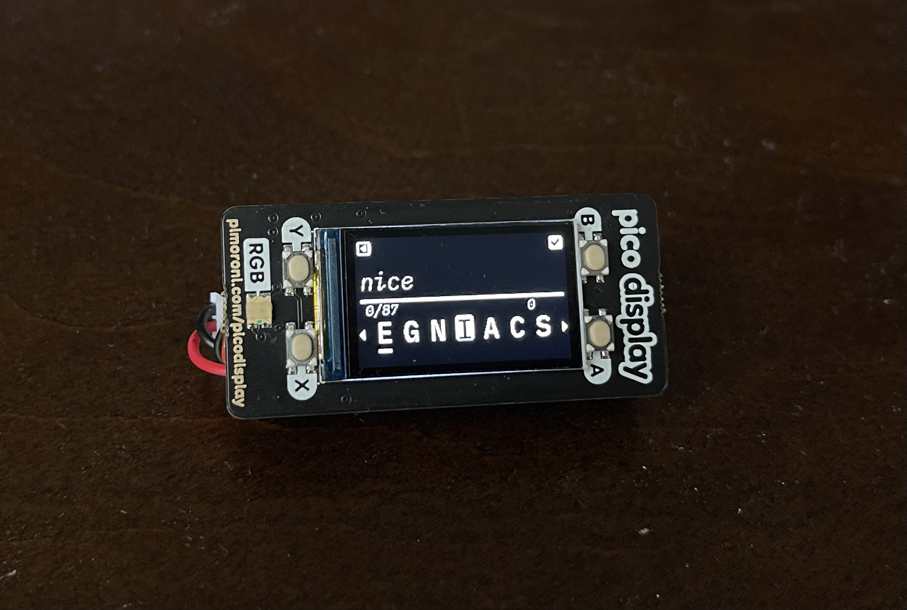
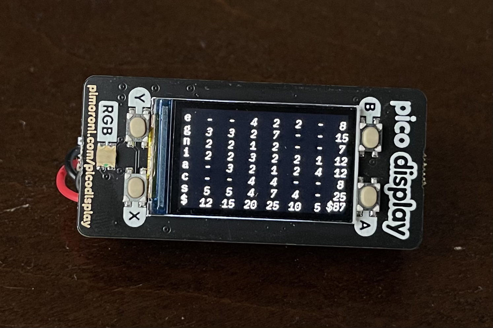

<p align="center">
<h3 align="center" >
  <strong style="font-size:1.17em">The BumbleBee</strong>
  <br>
  <h6 align="center" style="margin-top:0; margin-bottom:0">
    by <a href="https://nickesc.github.io">N. Escobar</a> / <a href="https://github.com/nickesc">nickesc</a>
  </h6>
  <h6 align="center" style="padding-top:5px; margin-top:0; margin-bottom:2em">
    a portable word game generator<br>based on <i>The New York Times</i> Spelling Bee
  </h6>
</h3>


## Table of Contents

1. [__Introduction__](#introduction)
2. [__Components__](#components)
   - [Hardware](#hardware)
   - [Software](#software)
3. [__Gameplay__](#gameplay)
   - [How to play](#how-to-play)
     - [Rules](#rules)
     - [Scoring](#scoring)
   - [Device Gameplay](#device-gameplay)
     1. [Game Screen](#game-screen)
     2. [Info Screen](#info-screen)
     3. [Grid Screen](#grid-screen)
     4. [Device Diagram](#device-diagram)
     5. [Tips](#tips)
     6. [Warnings](#warnings)
   - [CLI Gameplay](#cli)
     - [Running](#running-as-a-cli)
     - [Usage](#usage)
     - [Game Board](#cli-gameboard)
     - [Hints](#hints)
4. [__Setup and Assembly Guide__](#setup-and-assembly-guide)
   1.  [Install CircuitPython on the device](#i-install-circuitpython-on-the-device)
   2.  [Assemble the device](#ii-assemble-the-device)
   3.  [Deploy code to the device](#iii-deploy-code-to-the-device)
   4.  [Test the BumbleBee](#iv-test-the-bumblebee)
5. [__Design and Development__](#design-and-development)
   - [Design](#design)
   - [Development](#development)


## Introduction

### The BumbleBee is a portable word game generator -- its games are called `Bees`

The goal of each `Bee` is to make as many words as you can only using a set of seven letters, including one keyletter that needs to be in every word. 

<p align="center">
  
</p>

The device itself is built with a Pimoroni Pico LiPo as the controller and a Pimoroni Display Pack for the display and four face buttons. 

A detailed overview of the project, its purpose, main features, and how it addresses the problem it aims to solve. 
Provide a clear and concise summary of the project's functionality and the end goal it aims to achieve.


## Components:

### Hardware

Pimoroni Pico LiPo *16MB* | Pimoroni Pico Display Pack | ***Optional:*** <br> *110mHa* 3.7v LiPo battery (*301230*)
------------ | ------------- | -------------
[](https://shop.pimoroni.com/products/pimoroni-pico-lipo?variant=39335427080275) | [](https://shop.pimoroni.com/products/pico-display-pack) | 


### Software:
- [Adafruit CircuitPython for the Pimoroni Pico LiPo 16MB 7.3.3](https://circuitpython.org/board/pimoroni_picolipo_16mb/)
- CLI tested on Python 3.11
- Required Libraries from the [Adafruit CircuitPython Library Bundle 7.x](https://circuitpython.org/libraries):
  - [`adafruit_rgbled`](https://docs.circuitpython.org/projects/rgbled/en/latest/api.html)
    - Depends on [`simpleio`](https://docs.circuitpython.org/projects/simpleio/en/latest/)
  - [`adafruit_display_shapes`](https://docs.circuitpython.org/projects/display-shapes/en/latest/index.html)
  - [`adafruit_display_text`](https://docs.circuitpython.org/projects/display_text/en/latest/)
  - [`adafruit_bitmap_font`](https://docs.circuitpython.org/projects/bitmap-font/en/latest/)
  - [`adafruit_st7789`](https://docs.circuitpython.org/projects/st7789/en/latest/api.html)


## Gameplay

<p align="center"></p>

### How to play:

Every `Bee` has five components:
1. `letterlist`: a list of seven letters available to the player to create words with
2. `keyletter`: one of the seven letters; this letter must be in every word
3. `wordlist`: the list of words all the words in the game's dictionary that can be made using the `letterlist`
4. `buzzword`: one word from the `wordlist`; the source of the `letterlist`
5. `score`: the number of points you've earned from guessing words
   
The player must use the letters in the `letterlist` and the `keyletter` to make words in the `wordlist`. Each time the player guesses a word correctly, the word's value is added to their `score`. Words with more letters or words that use every letter, like the `buzzword`, are worth more points. The game is won when the player has found every word in the `wordlist`.

#### Rules:

- *The `keyletter` must appear at least once in every guess*
- *Letters can be used more than once in a guess*
- *Guesses must be at least four letters and less than sixteen letters*
- *Guesses must be in English*
- *Guesses cannot be proper nouns (i.e.: words like Italian or Google don’t count)*
- *Words that have already been found do not add to your `score`*

#### Scoring
> 4 letter words are worth 1 point
> 
> 5+ letter words aren worth 1 point per letter
>
> *Panagrams use all seven letters and add 7 extra points*
>
> *There is one Buzzword per `Bee` that adds 10 extra points*

### Device Gameplay

#### Game Screen


The Game Screen has the `letterlist` and the guess input. To move the letter selector right or left press the `A button` or the `X button`. To select a letter to add to the guess press the `B button`, and to delete the last letter from the guess press the `Y button`.

Other functions can also be accessed by holding down the buttons. To shuffle the `letterlist` hold the `A button`. To submit the guess hold the `B button`. To generate a new `Bee` hold the `X button`. Winning a `Bee` will also generate a new `Bee`. To swap to the Info Screen hold the `Y button`.

<br>
<p align="center"></p>
<br>

#### Info Screen


The Info Screen shows you information about the words that you’ve found so far. It shows your current `score` and number of words found, as well as a scrollable list of the words you’ve guessed correctly.

To scroll the correct-guess list right or left press the `A button` or the `X button`. To swap back to the Game Screen press the `Y button`. To swap to the Grid Screen press the `B button`.

<br>
<p align="center"></p>
<br>

#### Grid Screen


The Grid Screen provides you with hints about the words in the `Bee`’s `wordlist`.  Press any button to swap back to the Info Screen.

- Each row represents a letter in the `Bee`’s `letterlist`.
- Each interior column represents a word length in the `Bee`’s `letterlist`, starting at four and going up until the maximum word length. 
- Each interior cell represents the number of words in the `letterlist` that have the column’s word length and start with the row’s letter. 
- The right column shows the total number of words that start with each row’s letter. The bottom row shows the total number of words with each column’s word length.

<br>
<p align="center"></p>
<br>

#### Device Diagram


<br>
<p align="center"></p>
<br>

#### Tips
- The device automatically saves your game, and returns you to your last game when turned off and on.
- The device may take several minutes to create a new game; its processor is small and trying its best.
- While the device loads and thinks, it will turn the front LED red. If the light is on, the device is working.

  <table style="border: 0px" align=center>

    <tr style="border: 0px">
      <td style="border: 0px"></td>
      <td style="border: 0px"></td>
    </tr>

  </table>

- The BumbleBee’s dictionary does not contain every English word. Again, it is not powerful, and needs a smaller word set to function.
- When you submit a guess, the BumbleBee will give you an alert at the top of the screen to tell you how it was interpreted. These are a few of those alerts:
  
  <table style="border: 0px" align=center>

    <tr style="border: 0px">
      <td style="border: 0px"></td>
      <td style="border: 0px"></td>
    </tr>

    <tr style="border: 0px">
      <td style="border: 0px"></td>
      <td style="border: 0px"></td>
    </tr>

  </table
  
#### Warnings:
- DO NOT press the button labeled `BOOT`, it may corrupt the device
- Try not to disconnect or remove the LiPo battery from the device 
- Connecting the device to a computer will prevent it from saving


### CLI

While BumbleBee is designed to be deployed to a device, `Bees` can still be played without a device using a command-line interface and Python. `Bees` played over command-line are the same as the ones played on a device.

#### Running as a CLI

1. Clone or download [the BumbleBee repository](https://github.com/nickesc/BumbleBee):
    
    ```sh 
    git clone https://github.com/nickesc/BumbleBee
    ```

2. Enter the directory using the command-line:
    ```sh 
    cd BumbleBee
    ```

3. Run:
    ```sh 
    python3 bumblebee.py
    ```
   - To start a game with a new `Bee` instead of the last saved `Bee` state, run:
      ```sh 
      python3 bumblebee.py --new
      ```

#### Usage
```sh
usage: python3 Bee.py [-h] [-n]

A CLI word game generator based on the New York Times Spelling Bee

options:
  -h, --help  show this help message and exit
  -n, --new   start a new game; default is to use the Bee state stored in ./BumbleBee/bee_state

CLI commands:
  -cheat  toggle the wordlist
  -grid   toggle the hint grid
  -new    generate a new Bee

Running the CLI will start a Bee. By default, the game will use the data from the last saved Bee state. Enter words into the input to submit them as guesses or enter commands to execute them.

For more information visit:
  https://github.com/nickesc/BumbleBee#cli
```

#### CLI Gameboard


The gameboard, modeled after the hexagon from *The New York Times* Spelling Bee, is printed before each guess:

```

        o
    s      i
        c
    n      r
        t

Found: 0 (59 left)
Score: 0
[]
```

Below the gameboard is the input for the CLI. Enter words into the input to submit them as guesses or enter commands to execute them:

```
>> _
```

The game will print a response to the last guess above the gameboard, and as correct guesses are inputted to the command-line, words are added to the list at the bottom, and your score and the number of words found increase:

```
cotton was found!

        o
    s      i
        c
    n      r
        t

Found: 5 (54 left)
Score: 22
['coin', 'scoot', 'sonic', 'costs', 'cotton']
```

Once the player has guessed all the words in the `Bee`'s `wordlist` the game is won and it will end. To start a new game after winning, run the CLI again. A new `Bee` can also be generated at any time by inputting `-new` to the CLI.

##### Hints

Inputting `-grid` to the command-line will toggle whether the `Bee`'s hint grid is printed with the gameboard:

> ```
> o   -      -      -      -      -      -      -      -      -      -      0      
> s   1      3      3      1      1      -      -      -      -      -      9      
> i   1      1      1      1      3      3      -      -      -      -      10      
> c   6      5      6      7      4      2      4      2      1      1      38      
> n   -      -      -      -      -      -      -      -      -      -      0      
> r   -      -      -      -      -      -      -      -      -      -      0      
> t   -      1      1      -      -      -      -      -      -      -      2      
> 
> $   8(4)  10(5)  11(6)  9(7)  8(8)  5(9)  4(10)  2(11)  1(12)  1(13)  59($)
> ```
>
> The grid can be read the same way as on the device. The only benefit of this grid over the one on the device is that in the CLI the word lengths in each column are labeled in parentheses next to the column total.

Inputting `-cheat` to the command-line will toggle whether the `Bee`'s `wordlist` and `buzzword` are printed with the gameboard:

> ```
> Word List:
> {'citric': 6, 'cocoon': 6, 'cocoons': 7, 'coin': 1, 'coins': 5, 'concoct': 7, 'concoction': 10, 'concoctions': 11, 'concocts': 8, 'cons': 1, 'consist': 7, 'consists': 8, 'consort': 7, 'consorts': 8, 'constrict': 16, 'constriction': 19, 'constrictions': 20, 'constricts': 17, 'contort': 7, 'contortion': 10, 'contortions': 18, 'contorts': 8, 'coos': 1, 'corn': 1, 'corns': 5, 'corrosion': 9, 'cost': 1, 'costs': 5, 'cots': 1, 'cotton': 6, 'cottons': 7, 'crisis': 6, 'crisscross': 10, 'critic': 6, 'critics': 7, 'croon': 5, 'croons': 6, 'cross': 5, 'icon': 1, 'icons': 5, 'incision': 8, 'incisions': 9, 'incisor': 7, 'incisors': 8, 'instinct': 8, 'instincts': 9, 'intrinsic': 9, 'ironic': 6, 'scissor': 7, 'scissors': 8, 'scoot': 5, 'scoots': 6, 'scorn': 5, 'scorns': 6, 'sics': 1, 'sonic': 5, 'strict': 6, 'tonic': 5, 'tonics': 6}
> Buzzword: constrictions
> ```
>
> The ability to cheat with the `wordlist` is the only difference between the game on the device and the CLI. The `wordlist` shows you every word in the `Bee`'s dictionary that can be made using the letters in the `letterlist` and the `keyletter` and what each of them is worth.

## Setup and Assembly Guide

*This guide assumes the use of a UNIX based OS, some commands and folders may be different and some scripts may need to be edited if working on Windows*

### I. Install CircuitPython on the device

1. Test that the Pico LiPo is working – ensure that it turns on when connected to power
   
   > 
   >
   > *verify the device is on by checking that the power LED lights up when plugged in*
   
2. Download the ***CircuitPython 7.3.3*** `.uf2` file from the [CircuitPython Pimoroni Pico LiPo 16MB page](https://circuitpython.org/board/pimoroni_picolipo_16mb/)
   - this CircuitPython file can also be found in thsi project at [`uf2/adafruit-circuitpython-pimoroni_picolipo_16mb-en_US-7.3.3.uf2`](https://github.com/nickesc/BumbleBee/blob/main/uf2/adafruit-circuitpython-pimoroni_picolipo_16mb-en_US-7.3.3.uf2) 

3. Put the Pico LiPo into `Bootloader Mode` while connected to the computer
   - Because there is no reset button on the Pico LiPo, we can start the `UF2 Bootloader` by holding the `BOOT` button and pressing the `POWER` button twice while the device is powered to simulate a reset – a new drive named `RPI-RP2` should be connected to the computer if it was successful

      >  
      >
      > 1. *The Pico LiPo's `POWER` (top) and `BOOT` (bottom) buttons*
      > 2. *And the `RPI-RP2` Finder window, showing the `RPI-RP2` drive mounted*

4. Drag the Pico LiPo CircuitPython `.uf2` file into the `RPI-RP2` drive

    > 
    > 
    > *The Finder window may freeze when the file is dragged in*
 
 - though supposedly fixed in MacOS 13.1, [some users who have upgraded to MacOS Ventura have reported](https://blog.adafruit.com/2022/10/31/uploading-uf2-files-with-macos-13-0-ventura-apple-microbit_edu-raspberry_pi-circuitpython/) that the drag-and-drop functionality for bootloader drives has been broken; if there is an error when trying to drag the file, transfer the file to the `RPI-RP2` drive using the command-line. A command like this should work: `cp -X <download_location>/<circuitpython_file>.uf2 /Volumes/RPI-RP2`

1. Transferring the file will take a few seconds, but once the `RPI-RP2` drive ejects, a new drive labeled `CIRCUITPYTHON` should replace it if the device was flashed successfully
 
    > 
    >
    > *The newly mounted `CIRCUITPYTHON` Finder window, showing the board was flashed successfully*

2. Using a serial monitor ([the Mu Editor has a simple one](https://learn.adafruit.com/welcome-to-circuitpython/kattni-connecting-to-the-serial-console)) ensure that the [REPL](https://codewith.mu/en/tutorials/1.2/repl) is accessible

3. Eject the Pico LiPo drive from the computer 

### II. Assemble the device

1. Disconnect the Pico LiPo from power
2. Solder headers to the pin holes on the Pico LiPo – these are necessary for the display
   - here is a guide for help with that: [The MagPi: How to solder GPIO pin headers to Raspberry Pi Pico](https://magpi.raspberrypi.com/articles/how-to-solder-gpio-pin-headers-to-raspberry-pi-pico)
3. Now the satisfying part – slot the pins of the Pico LiPo into the pin sockets on the Pico Display Pack
   - the Pico Display Pack has a graphic of the USB port on the underside of the board to indicate in which orientation the Pico is supposed to be attached – make sure to align the port on the controller with the graphic and carefully line all the pins up so they go in the correct sockets
 4. ***Optional:*** Connect the battery's JST connector to the Pico LiPo's JST port – ensure the power and ground wires on the battery match the labels on the Pico LiPo
    - if the battery comes without a JST connector, as mine did, you may need to [solder one on yourself](https://youtu.be/3qclg4jz-54). Ensure the right wires from the battery are being connected to the right pins on the connector and that they also match up with the labels on the board
    1. Slot the battery in between the Pico LiPo and the Pico Display Pack and tuck in the wires, careful not to damage any connections

> <p align="center">
>   
>   <br>
>   <i>Once assembled, the device should look like this</i>
> </p>

### III. Deploy code to the device

#### Option 1: using the command-line

1. Connect the Pico LiPo to the computer and ensure it is powered
2. Clone [the BumbleBee repository](https://github.com/nickesc/BumbleBee) and enter the directory:
    
    ```sh 
    git clone https://github.com/nickesc/BumbleBee
    cd BumbleBee
    ```

3. Upload the code to the device by executing: 
    
    ```sh
    ./deploy.sh
    ```

   - if the command-line returns `Permission denied` or `Command not found`, execute `chmod +x ./deploy.sh` before running `./deploy.sh` again
   - the code may take a few minutes to upload, *do not* disconnect the device until the screen settles and the game starts
   - *do not* disconnect the device without ejecting it first

#### Option 2: drag-and-drop

1. Connect the Pico LiPo to the computer and ensure it is powered
2. Download the [latest release from the BumbleBee repository](https://github.com/nickesc/BumbleBee/releases)
3. Unzip the `BumbleBee_release.zip` archive
4. Drag the contents of the archive into the `CIRCUITPYTHON` drive, and replace any files that are already there
   - the code may take a few minutes to upload, ***do not*** disconnect or turn off the device until the screen settles and the game starts
   - ***do not*** disconnect or turn off the device without ejecting it first

### IV. Test the BumbleBee

*For more information on how to use the BumbleBee, which may be useful when testing, see the [Manual](docs/Manual.pdf) or [**Gameplay**](#gameplay) section*

1. Make sure that the BumbleBee can receive input and registers it by moving the letter selector or changing to different screens
   - If the BumbleBee is still connected to the computer, the serial monitor should print the inputs and interactions with the game
2. Eject the BumbleBee from the computer, disconnect it from the computer and cycle the power.
   - If the BumbleBee doesn't have a battery, connect it to a non-computer power source like a wall-plug and turn it on 
3. Find a word in the `Bee` to test the game functionality
4. Cycle the power again to make sure the game saves
   - the game state will not save if the BumbleBee was turned on while connected to a computer


## Design and Development

### Design

### Development

